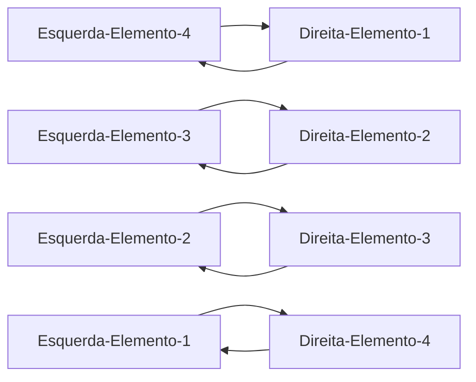
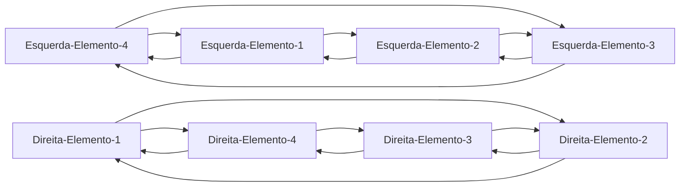
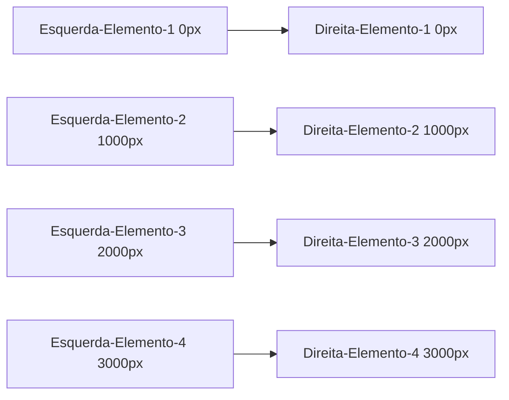
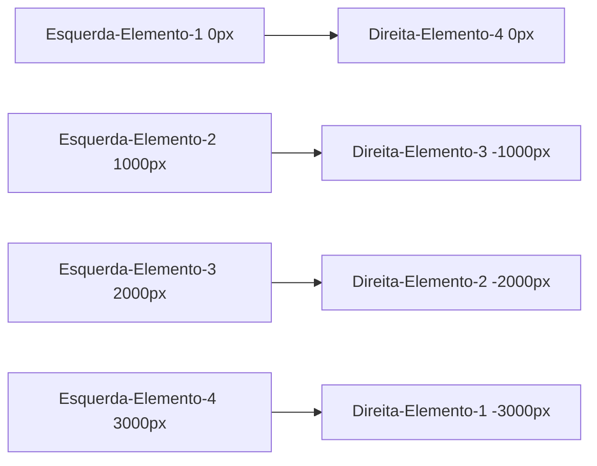

<h1 align="center"> Double Vertical Slider </h1>
<h6 align="center">Project <a href="https://doublevertical-slider-samuelcolares.vercel.app/">Link</a></h6>
<div align="center">


</div>

<details>

<summary  align="center" style="background-color: #ffff00; padding: 10px;">English</summary>

</details>
<br>
<h3>Descrição</h3>

Projeto criativo aonde enquanto uma seção se desloca para cima a seção ao lado se desloca em sentido contrário ↑↓ e vice e versa ↓↑ 


<hr>
<h3>Novidades aprendidas</h3>

Com esse projeto aprendi uma noção maior em com deslocar elementos dentro de uma div (elemento pai) com overflow: hidden;

a noção no HTML por trás do projeto está em posicionar duas divs uma para o lado esquerdo e outra para o direito e os elementos correspontendes são inversos

Exemplo: 





Como no HTML os elementos são posicionados na sua ordem de escrita, precisamos deslocar entao o elemento da esquerda para cima com position absolute e top -300vh (-300vh porque estou usando 4 elementos no exemplo, a conta sempre vai ser '-(TotalElementos-1)*100vh')

Com a suposição de uma tela com 1000px de altura (height)


no JavaScript vou deslocar os elementos da direita de forma negativa para subir do 1 para o 4: 
```Javascript
rightSideSlides.style.transform = `translateY(-${(rightSlides.length - 1) * window.innerHeight}px)`
```
Com isso ao dar load os elementos vao ficar assim:


agora só é preciso criar eventos para que quando o botão para cima for pressionado os elementos da esquerda se deslocam +1000px e os da direita em -1000px
e ao contrário com o botão para baixo

```javascript
upButton.addEventListener('click', () => changeSlide('up'))
downButton.addEventListener('click', () => changeSlide('down'))

const changeSlide = (direction) => {
    const sliderHeight = sliderContainer.clientHeight // sliderContainer.clientHeight = altura total da tela (usamos 1000px no exemplo)
    if(direction === 'up') {
        activeSlideIndex++
        if(activeSlideIndex > slidesLength - 1) {
            activeSlideIndex = 0
        }
    } else if(direction === 'down') {
        activeSlideIndex--
        if(activeSlideIndex < 0) {
            activeSlideIndex = slidesLength - 1
        }
    }

    slideRight.style.transform = `translateY(-${activeSlideIndex * sliderHeight}px)` // assim os slides da direita descem -1000px
    slideLeft.style.transform = `translateY(${activeSlideIndex * sliderHeight}px)` // e os slides da esquerda sobem +1000px
}
```
<hr>
<h3>Licença</h3>


Este projeto foi inspirado no projeto número 26 do repositório público 50 projects 50 days (https://github.com/bradtraversy/50projects50days)


---
